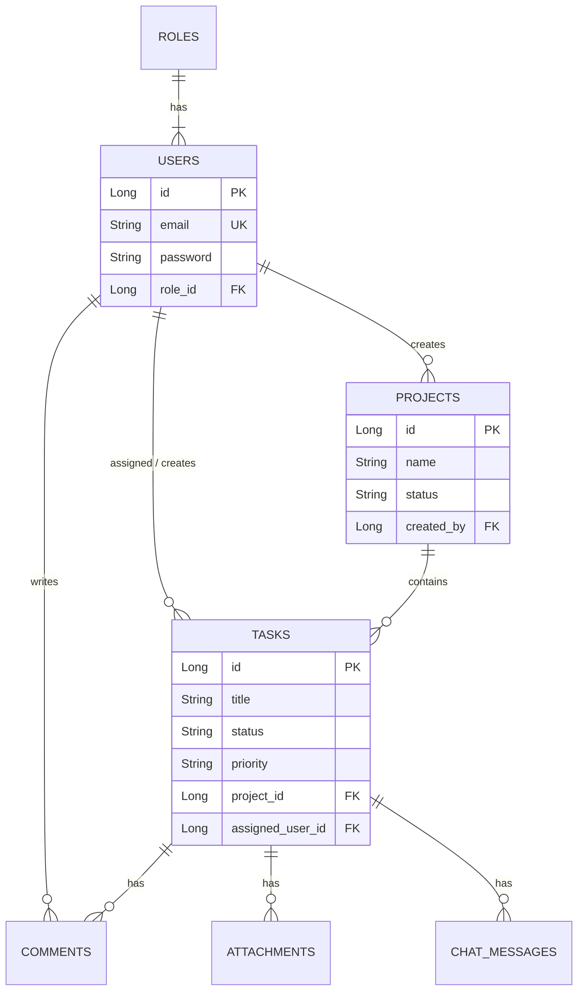

# Collabra 🚀
> **Collaborate. Organize. Achieve.**

Collabra is a modern, enterprise-grade, full-stack team collaboration platform meticulously engineered to streamline complex project management, task tracking, and team communication. Built with a high-performance React frontend and a robust Spring Boot backend, it provides a centralized hub that replaces fragmented toolchains (like Jira + Slack + Google Drive) with one cohesive experience.

    

---

## ✨ What Makes Collabra Special?
Unlike bulky enterprise tools that require weeks of onboarding, Collabra hits the perfect sweet spot between **power** and **simplicity**. 
* **Zero-Lag Communication:** Live WebSocket chat inside every single task means no more context switching to external messaging apps. When a task updates, your team knows instantly.
* **Beautifully Dark:** A meticulously crafted dark-theme UI using TailwindCSS that reduces eye strain, looks incredibly premium, and feels snappy thanks to Vite and React 19.
* **Cloud-Ready Storage:** Dynamic, interface-driven storage adapters allow you to instantly switch between local disk storage for rapid development and Cloudinary for globally distributed production delivery.
* **Deploy Anywhere:** Architected from the ground up to be container-native. Our custom Dockerfiles leverage Alpine Linux and Eclipse Temurin to keep image sizes tiny and startup times lightning fast.

---

## 🏗️ System Architecture & Data Flow

Collabra uses a modern, containerized microservices-style architecture, strictly separating the presentation layer from business logic to ensure high scalability and easy maintenance.

```mermaid
graph TD
    Client([Client Browser / React SPA]) 
    
    subgraph Frontend Tier
    Nginx[Nginx Web Server Container]
    end
    
    subgraph Backend Tier
    API[Spring Boot REST API Container]
    WS[STOMP WebSocket Broker]
    end
    
    subgraph Data & Storage Tier
    DB[(Neon PostgreSQL Serverless)]
    Cloudinary([Cloudinary CDN & Storage])
    end
    Client ---|HTTPS / Static Assets| Nginx
    Client ---|RESTful JSON| API
    Client ---|WSS (WebSockets)| WS
    
    API ---|JDBC (Hibernate/JPA)| DB
    API -->|Upload Stream API| Cloudinary
```

---

## 🌟 Comprehensive Features

### 📋 Project & Task Management
* **Hierarchical Organization:** Group tasks inside detailed Projects to maintain clean scopes and clear deliverables.
* **Kanban Workflow:** Visually track tasks across lifecycle stages (To Do, In Progress, Review, Testing, Done, Blocked) to identify bottlenecks.
* **Smart Assignments & Ownership:** Assign tasks to specific team members with dynamic priority levels (Low, Medium, High, Critical). Filter your dashboard to see only what matters to you.
* **Due Dates & Time Tracking:** Set hard deadlines. The system tracks exact timestamps for when tasks were created, updated, and completed for auditing purposes.

### 💬 Real-Time Collaboration
* **Live Task Chat:** Instant messaging built directly into the Task Details panel using STOMP WebSockets.
* **Threaded Comments:** Leave permanent, threaded feedback on tasks for long-form discussions that don't belong in the fast-paced chat.
* **Instant Presence:** Connection indicators show when the live chat broker is actively connected.

### 📁 Secure File Management
* **Cloud Attachments:** Seamlessly upload images, PDFs, and documents directly to tasks or projects.
* **Auto-Optimization:** Powered by Cloudinary, uploaded assets are automatically optimized for web delivery to save bandwidth.
* **Strict Access Control:** Only assigned users or platform Admins can delete sensitive files, preventing accidental data loss.

### 🔒 Advanced Security & RBAC
* **Role-Based Access Control:** Three distinct tiers (Admin, Project Manager, Member) to lock down sensitive actions like project creation and user deletion.
* **Stateless Authentication:** JSON Web Tokens (JWT) ensure secure, stateless API interactions without relying on server-side sessions.
* **Cryptographic Hashing:** Industry-standard BCrypt hashing (strength 10) for all user credentials ensures passwords are unrecoverable even in a breach.

### 🐳 DevOps & Infrastructure
* **Containerized Workloads:** Both frontend and backend are fully isolated in lightweight Docker containers.
* **Environment Agnostic:** Fully configurable via `.env` files, making it simple to deploy to Render, Vercel, AWS ECS, or local Docker desktop.
* **Automated Builds:** Maven wrapper (`mvnw`) included ensuring exact build reproducibility across all environments.

---

## 💡 Use Cases
* **Agile Software Teams:** Track sprints, attach architecture diagrams, and discuss bugs in real-time.
* **Marketing Agencies:** Manage campaigns, upload creative assets to Cloudinary, and get approvals.
* **Remote Startups:** A unified hub to replace disjointed task trackers and chat apps.

---

## 🛠️ Technology Stack

### Frontend (User Interface)
* **Core:** React 19, Vite
* **Styling:** TailwindCSS, Lucide Icons
* **Network & State:** Axios, React Hooks
* **Real-time:** SockJS, STOMP.js
* **Deployment:** Docker (Nginx Alpine), Vercel

### Backend (REST API)
* **Core:** Java 21, Spring Boot 3
* **Security:** Spring Security, JWT Auth, BCrypt
* **Database:** PostgreSQL (Neon Serverless DB), Spring Data JPA, Hibernate
* **Storage:** Cloudinary SDK
* **Deployment:** Docker (Eclipse Temurin JDK), Render

---

## 📂 Project Structure

```text
Collabra/
├── backend/                       # Spring Boot Application
│   ├── src/main/java/.../teamcollab/
│   │   ├── config/                # Security, CORS, WebSocket, Storage Configs
│   │   ├── controller/            # REST API Endpoints
│   │   ├── dto/                   # Data Transfer Objects (Req/Res)
│   │   ├── exception/             # Global Error Handling
│   │   ├── model/                 # JPA Entities (User, Task, Project, etc.)
│   │   ├── repository/            # Spring Data JPA Interfaces
│   │   ├── security/              # JWT Filters & Providers
│   │   └── service/               # Business Logic & Cloudinary Uploads
│   ├── src/main/resources/        # application.properties
│   └── Dockerfile                 # Backend Container Config
│
├── frontend/                      # React SPA
│   ├── src/
│   │   ├── components/            # UI Components (Kanban Board, Modals)
│   │   ├── context/               # React Context (Auth State)
│   │   ├── pages/                 # Route Views (Dashboard, Login, Projects)
│   │   └── services/              # Axios API clients
│   ├── index.html
│   ├── tailwind.config.js
│   └── Dockerfile                 # Frontend Nginx Container Config
│
└── docker-compose.yml             # Local Multi-Container Orchestration
```

---

## 📊 Core Database Schema (ERD)

Collabra relies on a fully relational PostgreSQL database mapped via Spring Data JPA. Here is a high-level Entity Relationship Diagram:



---

## ⚙️ Environment Configuration Guide

To run Collabra successfully, you must configure the following environment variables. The system will safely fall back to defaults where appropriate, but production environments require all of them.

| Variable Name | Description | Example Value | Required |
|---------------|-------------|---------------|----------|
| `DB_URL` | The JDBC connection string for PostgreSQL. | `jdbc:postgresql://ep-neon...` | Yes |
| `DB_USERNAME` | Database user with read/write access. | `neondb_owner` | Yes |
| `DB_PASSWORD` | Database password. | `super_secret_db_pass` | Yes |
| `JWT_SECRET` | A 256-bit+ secure key for signing auth tokens. | `my_long_jwt_secret_key_...` | Yes |
| `STORAGE_TYPE` | Defines the file storage adapter. | `cloudinary` (or `local`) | No |
| `CLOUDINARY_CLOUD_NAME` | Your unique Cloudinary identifier. | `collabra_project` | If Cloudinary |
| `CLOUDINARY_API_KEY` | Public API key for Cloudinary. | `123456789012345` | If Cloudinary |
| `CLOUDINARY_API_SECRET`| Secret API key for Cloudinary. | `abcDEFghiJKLmno` | If Cloudinary |
| `CORS_ALLOWED_ORIGINS` | Limits API access to your specific frontend. | `https://your-vercel.app` | Yes (Prod) |
| `VITE_API_BASE_URL` | (Frontend) Points React to your backend API. | `https://api.render.com` | Yes |

---

## 🔌 API Integration & WebSockets

Collabra uses both traditional REST and real-time WebSockets to deliver a snappy experience.

### WebSocket Broker (STOMP)
* **Endpoint:** `/ws-chat`
* **Topic Subscription:** Clients subscribe to `/topic/task/{taskId}` to listen for incoming messages specific to that task.
* **Publishing:** Clients send JSON payloads to `/app/chat.sendMessage` which the Spring Boot `SimpMessagingTemplate` broadcasts to the relevant topic.

### Key REST Endpoints
* `POST /api/auth/login` - Authenticate and receive a JWT token (Bearer).
* `GET /api/projects` - Retrieve all projects the authenticated user has access to.
* `POST /api/attachments/upload?taskId={id}` - Expects `multipart/form-data`. Streams directly to Cloudinary.
* `GET /api/tasks/{taskId}/chat` - Retrieves historical chat messages before the WebSocket connection takes over.

---

## 🛡️ Security & Authentication Flow

Collabra takes security seriously, implementing defense-in-depth at multiple layers:
1. **Authentication:** Upon successful login, the server generates a JWT signed with HMAC-SHA256. This token contains the user's ID and Role.
2. **Authorization:** Every incoming request is intercepted by the `JwtAuthenticationFilter`. If valid, the user's security context is populated.
3. **Controller Security:** Endpoints are protected using `@PreAuthorize("hasRole('ADMIN')")` or custom logic to ensure users can only modify tasks they own or manage.
4. **CORS Protection:** Cross-Origin Resource Sharing is strictly limited to the configured `CORS_ALLOWED_ORIGINS`, preventing unauthorized domains from interacting with the API.
---

## 🔑 Demo Credentials

To test the application immediately (either locally or on your live URL) without registering new accounts, you can use these preconfigured test credentials mapping to the three core system roles:

*   **Admin User** (Full platform read/write & deletion controls):
    *   **Email:** `admin@admin.com`
    *   **Password:** `admin`
*   **Manager User** (Can create and manage tasks/projects):
    *   **Email:** `manager1@manager1.com`
    *   **Password:** `manager1`
*   **Member User** (Standard task assignment, execution & comments):
    *   **Email:** `member1@member1.com`
    *   **Password:** `member1`

---

## 🚀 Quick Start (Docker)

The absolute fastest way to get Collabra running locally without installing Java or Node.js is via Docker Compose.

1. **Clone the repository:**
   ```bash
   git clone https://github.com/asarthak2003/Collabra.git
   cd Collabra
   ```

2. **Configure Environment Variables:**
   Update the `docker-compose.yml` file with your specific database and JWT credentials, or place an `.env` file in the root.

3. **Start the containers:**
   ```bash
   docker-compose up -d --build
   ```

4. **Access the application:**
   * Frontend UI: `http://localhost:3000`
   * Backend API: `http://localhost:8080/api`

---

## 💻 Local Development Setup

If you wish to run the frontend and backend separately for active development (hot-reloading):

### Backend Setup (Java 21)
1. `cd backend`
2. Create your `.env` file (see Environment Guide above).
3. Run the Spring Boot application using the Maven wrapper:
   ```bash
   ./mvnw spring-boot:run
   ```

### Frontend Setup (Node.js)
1. `cd frontend`
2. Create your `.env` file with `VITE_API_BASE_URL=http://localhost:8080`
3. Install dependencies and start the Vite dev server:
   ```bash
   npm install
   npm run dev
   ```

---

## 🌍 Production Deployment Guide

Collabra is configured for independent, scalable containerized deployment.

**Backend (e.g., Render, Railway, AWS ECS):**
* Deploy using your custom built Docker image: `asarthak2003/collabra-backend:latest`
* Ensure all environment variables are securely added to the platform's secret manager.
* Expose port `8080`.

**Frontend (e.g., Vercel, Netlify):**
* Connect your GitHub repository directly to Vercel.
* Build Command: `npm run build`
* Output Directory: `dist`
* Set `VITE_API_BASE_URL` to your live backend URL (do not include trailing slashes).

---

## 🤝 Contributing & Code of Conduct

We welcome contributions from the community! To contribute to Collabra:
1. **Fork the Repository:** Create your own branch (`git checkout -b feature/AmazingFeature`).
2. **Follow Architecture:** Ensure backend code follows the Controller -> Service -> Repository pattern.
3. **Test:** Run backend tests using `./mvnw test` before submitting.
4. **Commit:** Write clean, descriptive commit messages.
5. **Pull Request:** Open a PR against the `main` branch detailing your changes.

Please treat all community members with respect. Harassment or abusive behavior will not be tolerated.

---

## 🗺️ Roadmap
* [ ] **Email Notifications:** Integrate JavaMailSender to alert users when they are assigned a new task.
* [ ] **OAuth2 Authentication:** Allow single sign-on (SSO) via Google and GitHub.
* [ ] **Advanced Analytics:** A visual dashboard with Chart.js showing sprint velocity and project completion rates.
* [ ] **Global Search:** ElasticSearch integration to instantly find tasks, projects, and users.

---

## 📄 License
This project is open-source and licensed under the MIT License. Feel free to fork, modify, and distribute!
